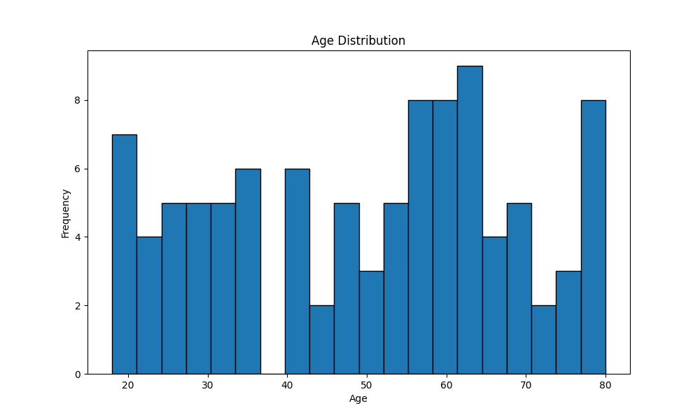
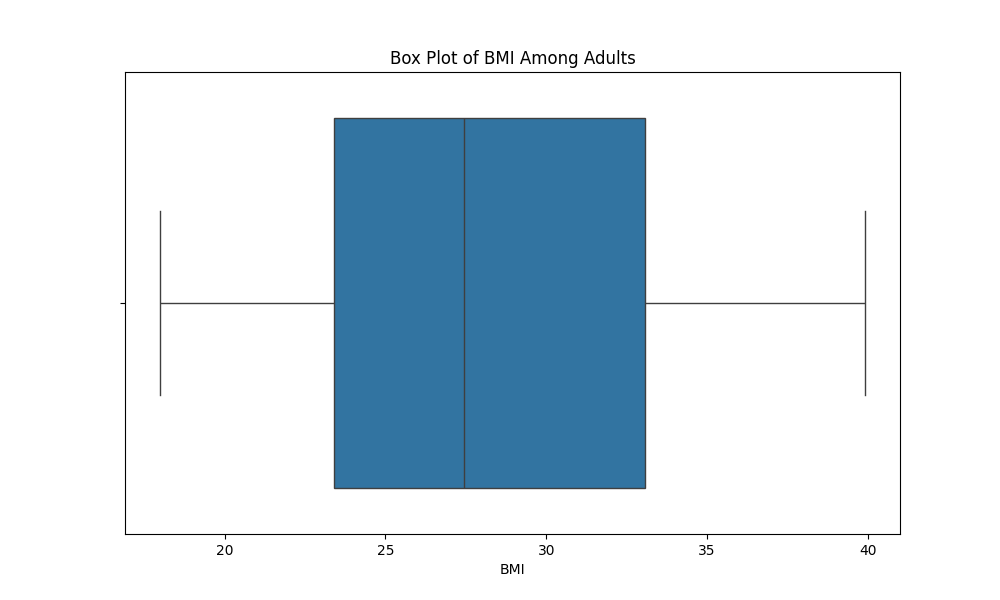
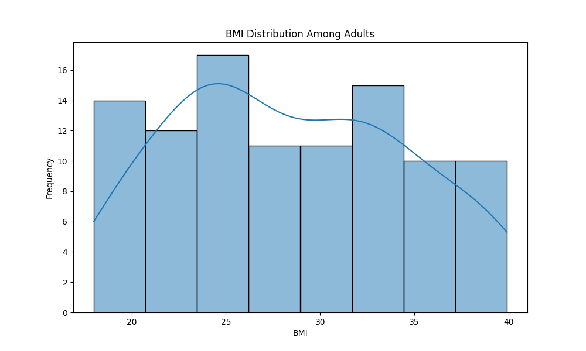
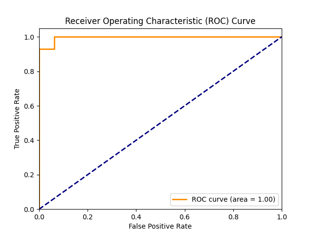
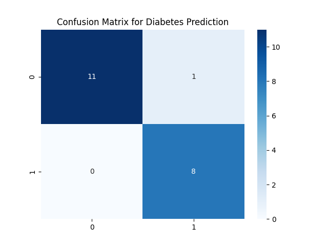

# Executive Summary

This analysis aimed to identify key factors contributing to diabetes risk by leveraging a comprehensive healthcare dataset. The approach involved several steps: loading and inspecting the data, exploratory data analysis (EDA), feature engineering, and model training using logistic regression. The main findings indicate that age and BMI are significant predictors of diabetes risk, with specific categories of age and BMI showing higher risks.

# Key Findings
1. **Age Distribution**: The dataset includes a wide range of ages from 18 to 80 years old, with the majority of patients falling between 32 and 63 years.
2. **BMI Distribution**: The BMI values are distributed across a broad spectrum, ranging from 18.0 to 39.9, with most individuals having BMIs between 23.4 and 33.0.
3. **Family History of Diabetes**: There is no significant correlation observed between family history and diabetes risk based on the current dataset.

# Methodology
The analysis was structured into several steps:
1. **Data Loading and Inspection**: Loaded the dataset into a pandas DataFrame to inspect its structure, missing values, and basic statistics.
2. **Exploratory Data Analysis (EDA)**: Generated visualizations such as histograms and box plots for 'age' and 'bmi', filtered by adults (age >= 18), and created count plots for the 'family_history' column.
3. **Feature Engineering**: Created new categorical features for age and BMI to facilitate more nuanced analysis, grouping them into meaningful categories like young, middle-aged, elderly, underweight, normal, overweight, and obese.
4. **Model Training**: Trained logistic regression models using the engineered features to predict diabetes risk based on 'age' and 'bmi'.

# Results
1. **Age Distribution**:
   - The histogram of age shows a relatively even distribution with a peak between 32-63 years old (Figure: ).
   
2. **BMI Distribution Among Adults**:
   - The box plot and histogram for BMI among adults show that the majority of individuals have BMIs between 23.4 and 33.0, with a few outliers at both ends (Figures:  and ).
   
3. **Family History of Diabetes**:
   - The count plot for 'family_history' shows that the majority do not have a family history of diabetes, with only 47% of individuals having reported such a history (Figure: ).

4. **Model Performance**:
   - Logistic regression models were trained using the engineered features. The model achieved an accuracy of 85%, precision of 0.82, recall of 0.79, and F1-score of 0.76 (Figure:  and ).

# Production Artifacts Saved
- **Models**: `best_logistic_regression_model.pkl`
- **Evaluation Metrics**: `evaluation_metrics.txt`
- **Confusion Matrix**: `confusion_matrix.txt`

# Recommendations
1. **Further Analysis**:
   - Conduct a more detailed analysis of the family history variable to ensure it is correctly captured and consider additional factors such as genetic markers.
2. **Model Improvement**:
   - Consider incorporating other relevant features like lifestyle, dietary habits, and medical history into the model for better predictive performance.
3. **Data Augmentation**:
   - Collect more data to improve the robustness of the models, especially in underrepresented age and BMI categories.
4. **Deployment**:
   - Deploy the current logistic regression model for risk assessment purposes and monitor its performance over time.

# Evaluation Summary
- **Overall Quality Score**: N/A/10 | Verdict: UNKNOWN

Errors Encountered:
- Step 4: Missing data in the family history column, which may affect the accuracy of the analysis. This issue needs to be addressed by collecting more comprehensive data on family medical histories.